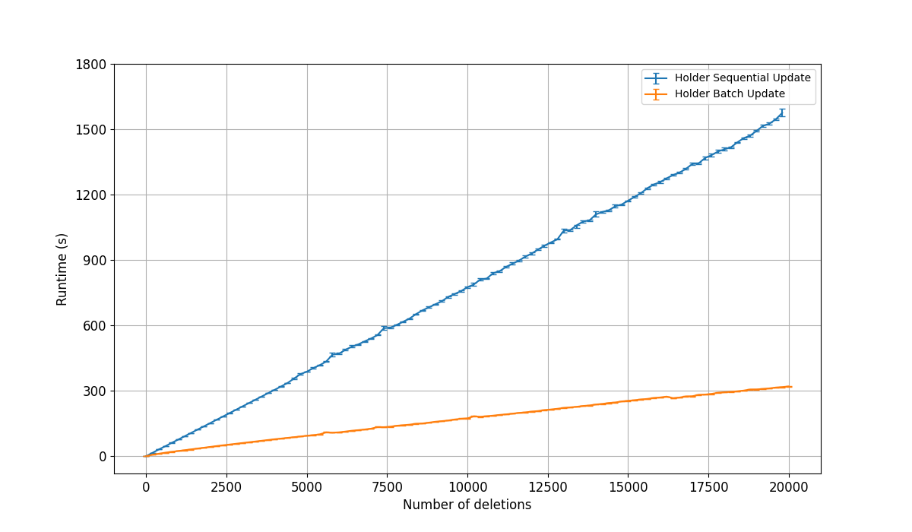

# Swiss e-ID Revocation

This repository contains the implementation of an accumulator-based revocation scheme for electronic identities in the type described in Scenario B of the [Swiss eID Community](https://github.com/e-id-admin/open-source-community/blob/main/discussion-paper-tech-proposal/discussion-paper-tech-proposal.md).

**Warning**: the code in this repository is provided as a proof of concept for scalability evaluation. It is not recommended for production use.

## Structure of the Repository
This repository contains the following packages:

- `accumulator`: implements a pairing-based accumulator of the type described in Section 4 of my thesis. The accumulator is built on top of the communication-efficient construction provided in [KB21](https://ieeexplore.ieee.org/abstract/document/9505229). Additionally, our accumulator provides support for batch operations, optimizing the work in [VB22](https://link.springer.com/chapter/10.1007/978-3-030-95312-6_17). Finally, our ZK membership proofs are based on the BBS full-disclosure protocol presented in [TZ23](https://link.springer.com/chapter/10.1007/978-3-031-30589-4_24), which does not require *any* pairing operation on the prover side;

- `entities`: implements the main roles defined in the [Swiss Trust Infrastructure](https://github.com/e-id-admin/open-source-community/blob/main/discussion-paper-tech-proposal/discussion-paper-tech-proposal.md) (i.e., *Issuer*, *Holder*, and *Verifier*) making use of the cryptographic primitives provided by the `accumulator` package; 

- `network`: provides basic server implementations for the *Base Registry* and the *Issuer*. It also contains wrappers around *Holder* and *Verifier* for conveniently querying the servers;

- `colombo_thesis.pdf`: my master's thesis on scalable and privacy-preserving revocation of verifiable credentials.

## Benches
The `benches` folder contain the code that you can use to reproduce the benchmarks in Section 4 of my thesis. To run a single bench file, execute `cargo bench --bench [file-name]` without the `.rs` suffix.

For instance, witness update benchmarks can be tested by executing `cargo bench --bench updates`.

In the following, you can find a summary of the main results:

#### Optimized Bactch Update vs Sequential Update ####

In the picture below you can see the difference between updating witnesses using optimized polynomial evaluation (orange line), and applying the update algorithm without optimizations (blue line). Notably, the optimization in polynomial evaluation reduces by a *logarithmic factor* the results achieved in [VB22](https://link.springer.com/chapter/10.1007/978-3-030-95312-6_17). For large batch sizes this translates to ~5x speed-up.

Note that before evaluation we re-write update polynomials in Non-Adjacent Form (NAF). This is why the bath update performances are better than those included in page 43 of my thesis. 

#### Aggregating Multiple Batches  ####
In this experiment we fix a total of 5000 deletions, which we split into multiple batches, all of equal size. In the figure below we see that, with *small* batches (e.g., individual size < 100), the run-time of the batch update algorithm without aggregation is similar to the single update algorithm. On the opposite, the cost of batch updates with aggregation remain constant, *independently* of the individual size of each batch.
 

As we highlight in page 42, this *eliminates* the need of computing update polynomials.

## Credits
The *accumulator* package is based on top of the ALLOSAUR [single-server implementation](https://github.com/sam-jaques/allosaurust), developed by Mike Lodder and Sam Jaques. 